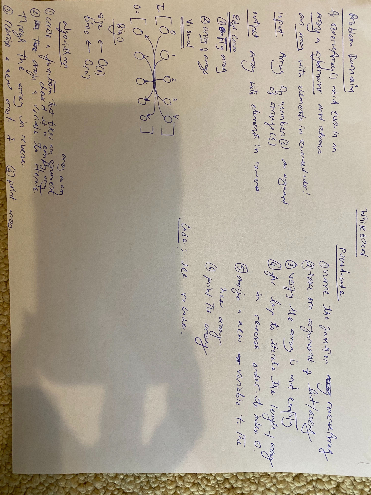

## __Reverse an Array__
See [solution](challenges/array_reverse/array_reverse.py)

A function to reverse an array given as an argument.

  * Challenge
  Write a function called reverseArray which takes an array as an argument. Without utilizing any of the built-in methods available to your language, return an array with elements in reversed order.

  * Approach & Efficiency
  I decided to choose the for loop to iterate over the list and then make a new array and mutate it with appending the next number into it, until the for loop was completed.  The original array was left unchanged.
  This is inefficient due to selecting the for loop, which affects __time__ in linear manner, and the __efficiency__ is affected in a exponential manner as I have to create another list and then print it. It also uses up too much __memory__.

  * The built in reverse() is a generator and saves time and is efficient.

  * Specificiations used : none

  * Solution

