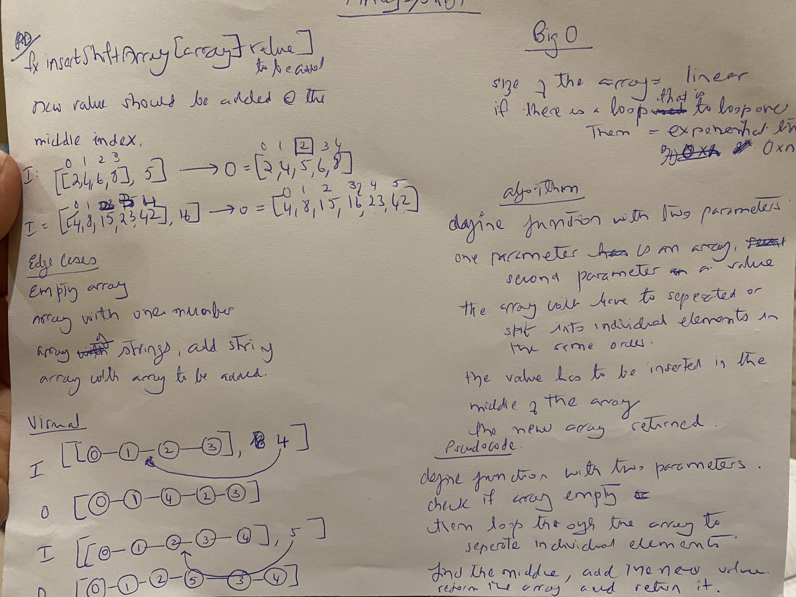

## __Shift an Array__
### [Table of Contents](../../../README.md)
See [solution](array_shift.py)

A function to .

  * Challenge
  Write a function called __insertShiftArray__ which takes in an array and the value to be added. _Without utilizing any of the built-in methods_ available to your language, __return an array__ with the new value added at the __middle index__.

     __Approach & Efficiency__
* I approached it by using a for loop to take each element of the array and then place it into a new array until the mid point is reached.  Then using one built in function .append i appended the inserted argument into the new list, and then continued through the loop until the end of the array
* The second method uses the built in method .insert as comparison.
 * The first method is inefficient due to selecting the for loop, which affects __time__ in linear manner, and the __efficiency__ is affected in a exponential manner. This also uses up much __memory__.

  * Specificiations used :     gitignore, editorconfig

  * Solution

